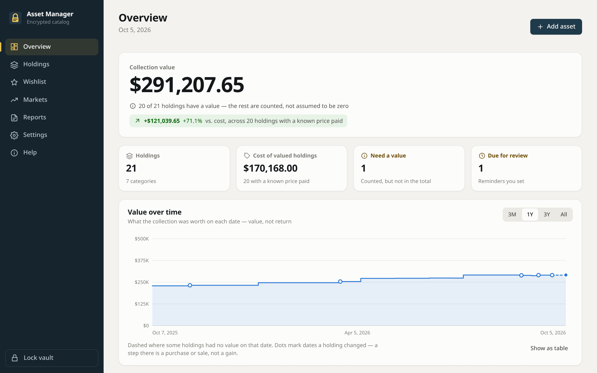
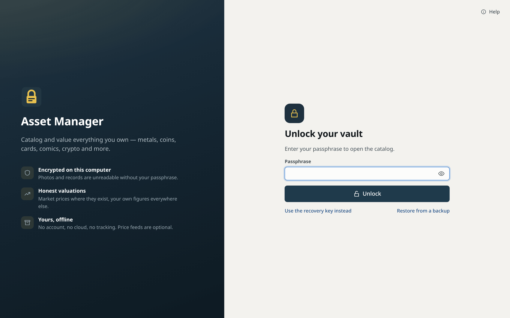
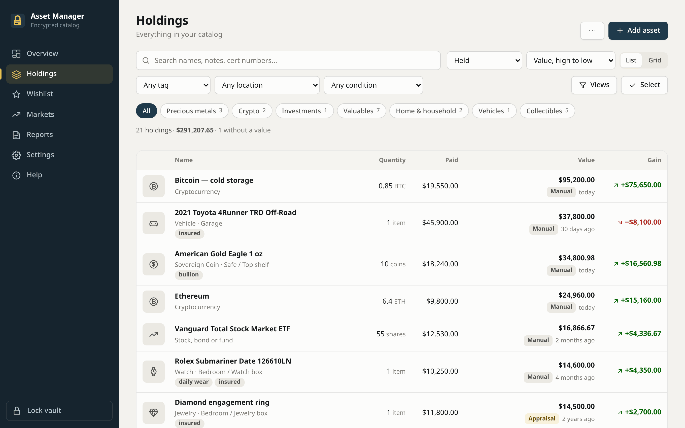

# Asset Manager

A local-first desktop app for cataloging and valuing physical and digital
assets — precious metals, comics, trading cards, coins, crypto, and other
collectibles.

> **Status: alpha.** Feature-complete for personal use on Linux. Not yet
> signed or released; see [Before a public release](#before-a-public-release).



| | |
|---|---|
|  |  |
| Unlock with a passphrase — or the recovery key | Every holding, its cost, value, source and gain |

<sub>Screenshots use a made-up demo catalog, built through the app's own commands (`npm --prefix apps/desktop run screenshots`).</sub>

## Why

Two jobs, in priority order:

1. **Catalog** — record what you own: photos, condition, provenance,
   acquisition cost, and storage location.
2. **Value** — track what it's worth, with as much automation as each asset
   class honestly allows.

Metals and crypto have real price feeds. Collectibles mostly do not, so manual
valuation is a first-class path rather than a fallback.

## What it does

- **Catalog anything** — precious metals, crypto, comics, sports and TCG cards,
  collector coins, watches, jewelry, art, memorabilia, sealed product, video
  games, vinyl, instruments, wine, cash, or a general item. Graded
  collectibles validate the grade against the grader's own scale (PSA has no
  65, PCGS no 9.8) and name themselves from their fields.
- **Photos**, encrypted before they reach the disk, with a cover photo,
  thumbnails and a full-size viewer. Scan a slab label's barcode from a photo
  to fill in the certificate number.
- **Values that stay honest.** Metals follow spot (gross vs. fine weight,
  purity and premium handled explicitly — melt and market shown apart); coins
  follow their CoinGecko price at full precision; everything else is valued by
  hand, with a date, a basis and a note. Typing a value by hand switches an
  asset off market tracking, so a refresh never overwrites it. Unpriced items
  are counted, never treated as zero.
- **History.** Buying more, selling some, selling all and fixing a miscount
  are dated events, so the value chart shows what you held *then* — a sale
  ends an item's contribution without erasing its past.
- **Overview** with total value, gain against cost (only where the cost of the
  whole holding is known, and saying over how many), allocation, largest holdings, what needs a value
  and what is due for a revalue reminder.
- **Bulk value entry** in the holdings list, and a **CSV round trip** for
  editing a few hundred items in a spreadsheet — blank cells preserve, `-`
  clears, stale exports are refused, reimport is idempotent.
- **Insurance report** to print or save as PDF, with photos, identifying
  details, the source of every figure and the evidence behind it (comparable
  sales, range, confidence); storage locations are left out
  unless you include them.
- **Backup and restore** of the whole encrypted vault, without signing out.
  A restore is unlocked and checked — database integrity, every photo present
  and intact — before it replaces anything. Backups list no plaintext photo
  hashes. Passphrase change and recovery-key rotation in Settings, staged so
  an interruption never leaves the vault unopenable.
- **Documents viewed in the app**: PDFs open in a built-in viewer, decrypted
  in memory only. "Save a copy…" writes a decrypted photo or PDF where you
  choose, after saying it will be unencrypted.
- **Built-in help** covering every feature step by step, searchable, and
  reachable from the unlock screen for when you cannot get in. Press `?`
  anywhere.
- **Watch-only Bitcoin balances**, behind their own opt-in. Seed phrases and
  private keys are refused before they can be stored.

## Security

The catalog is an itemized list of valuables **including where they are
stored**. It is encrypted at rest, by default, with no opt-in step:

- **Argon2id** derives a key-encryption key from your passphrase, which wraps
  a random data key. A recovery key wraps the same data key, so recovery
  needs no backdoor.
- **XChaCha20-Poly1305** protects photos, in a chunked streaming format that
  rejects truncation, reordering and tampering.
- **HKDF-SHA256** derives separate subkeys for database, objects and
  thumbnails, so no key is reused across purposes.
- Photos on disk are ciphertext under opaque random filenames. Copying the
  vault directory without the credentials yields nothing.

### There is no password reset

Lose **both** the passphrase and the recovery key and the catalog is
unrecoverable. Not by us, not by anyone — there is no account, no server, and
nobody holding a master key, including the author. The recovery ceremony makes
you acknowledge the key and retype its last six characters before it will let
you continue, specifically so this cannot happen by clicking past a dialog.

Print the recovery sheet. Keep it somewhere a burglar would not look.

### What this does not protect against

Read the [threat model](docs/threat-model.md) for the full account. The short
version: a compromised machine while the vault is unlocked, swap on a host
without encrypted swap, anything you deliberately export, and a weak
passphrase. Full-disk encryption is complementary, not a substitute — it
protects a powered-off machine only.

### Network access

Everything works offline. Price fetching is optional and off until you add an
API key (free tiers of [metals.dev](https://metals.dev) and
[CoinGecko](https://www.coingecko.com/en/api) are enough); updates happen when
you ask, plus an opt-in metals refresh on unlock. Asking a provider for prices
does tell it which assets you hold — see the threat model's network section
before enabling it.

## Building

Requires Rust 1.93.1 (pinned in `rust-toolchain.toml`), Node.js, and the
[Tauri prerequisites](https://v2.tauri.app/start/prerequisites/) for your
platform.

```bash
npm --prefix apps/desktop install
cargo test --workspace          # Rust tests, including an end-to-end IPC test
npm --prefix apps/desktop test  # frontend unit tests and the IPC contract check
npm run dev                     # run the app
```

Browser tests drive the built frontend in Chromium under the production CSP,
against responses recorded from the real commands. They use a system Chromium
when there is one (otherwise `npx playwright install chromium` first):

```bash
npm --prefix apps/desktop run test:ui
```

In debug builds, `AM_VAULT_DIR=/some/dir npm run dev` points the app at a
throwaway vault instead of your real one. Release builds ignore it.

One script per bundle target, each forwarding extra arguments to Tauri:

```bash
npm run build:linux-appimage    # primary target
npm run build:linux-deb
npm run build:windows           # must run on Windows
npm run build:macos             # must run on macOS
```

Native bundles must be built on their own OS. Set `AM_OUTPUT_NAME` to override
the artifact filename.

### Linux / Wayland note

WebKitGTK's DMA-BUF renderer negotiates explicit GPU sync and then commits a
buffer without an acquire point. Strict compositors (KWin, among others)
reject this as a protocol violation and the app exits before its window
appears:

```
Gdk-Message: Error 71 (Protocol error) dispatching to Wayland display.
```

The app sets `WEBKIT_DISABLE_DMABUF_RENDERER=1` for itself at startup, so no
launcher script or environment setup is needed. This is an upstream
WebKitGTK/Mesa issue, not a configuration problem.

## Layout

| Path | Purpose |
|---|---|
| `crates/am-core` | Money, quantities, metal and coin valuation, collectible schemas — pure functions |
| `crates/am-crypto` | Key hierarchy, key wrapping, encrypted object format |
| `crates/am-storage` | Vault header, schema, assets, events, valuations, pricing, CSV, backup/restore |
| `apps/desktop/src-tauri` | Tauri shell: IPC commands, the `asset://` media handler, price providers |
| `apps/desktop/src` | Frontend — plain ES modules, no framework; `views/` holds one file per screen |
| `docs/vault-format.md` | Normative on-disk format specification |
| `docs/chart-semantics.md` | What a point on the value chart means |
| `docs/threat-model.md` | What the encryption does and does not protect |

## Before a public release

- Release signing and reproducible builds.
- AppImage tested on a clean system with the supported WebKitGTK baseline.

## License

[AGPL-3.0](LICENSE). Parts of `am-crypto` are adapted from
[QiRing](https://github.com/gcoxdev/QiRing); see
[`crates/am-crypto/VENDOR.md`](crates/am-crypto/VENDOR.md).

## Security and releases

Report vulnerabilities privately — see [SECURITY.md](SECURITY.md). How
releases are checked and signed, and how to verify a download, is in
[docs/releasing.md](docs/releasing.md).

Release signing key: **none published yet**. Until a fingerprint appears
here, releases are unsigned; check downloads against the build-provenance
attestation instead (`gh attestation verify`, see the release notes).
